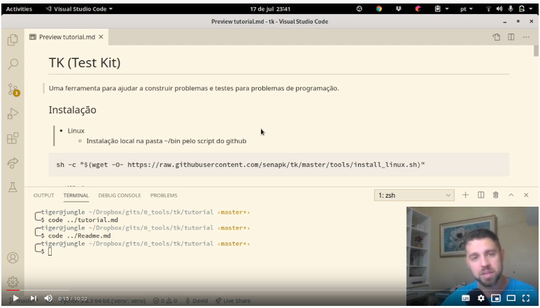

# tk Test Kit

<!--TOC_BEGIN-->
- [Tutorial](#tutorial)
- [Instalação](#instalação)
- [O que é um teste?](#o-que-é-um-teste)
- [Formatos de teste:](#formatos-de-teste)
  - [Sintaxe TIO](#sintaxe-tio)
  - [Escrevendo alguns testes](#escrevendo-alguns-testes)
  - [Listando os testes](#listando-os-testes)
- [Testando um código com erros](#testando-um-código-com-erros)
- [Executando](#executando)
- [Convertendo entre formatos](#convertendo-entre-formatos)
- [Exemplos rápidos](#exemplos-rápidos)
- [Subcomandos](#subcomandos)
  - [List](#list)
  - [Run](#run)
  - [Compile](#compile)
  - [Build](#build)
  - [Update](#update)
- [Formatos de testes suportados](#formatos-de-testes-suportados)
  - [VPL](#vpl)
  - [OBI](#obi)
  - [TIO](#tio)
- [Rodando](#rodando)

<!--TOC_END-->

## Tutorial

Se for assistir, use o modo velocidade x2 do Youtube porque eu falo devagar. :)

[](https://www.youtube.com/watch?v=nt4dDLzGubA&t)

## Instalação

- Baixe o [tk.py](tk.py) e coloque em algum lugar do seu PATH

- No linux, ou usando o WSL, você pode rodar o seguinte comando para instalar:

```bash
curl -sSL https://raw.githubusercontent.com/senapk/tk/master/scripts/linux_install.sh | bash

```

## O que é um teste?

- Um teste define qual o comportamento esperado de um programa determinístico. Para uma determinada entrada, o programa deve gerar **sempre** a mesma saída.
- A entrada e saída e o comportamento esperado devem ser bem definidos, por exemplo:
  - Dados dois números inteiros de entrada, um por linha, mostre o resultado da divisão. Se o resultado for inteiro, mostre o valor inteiro, se for flutuante, mostre com duas casas decimais.

## Formatos de teste:

- Um arquivo de texto com vários testes:
  - modelo TIO(test input output).
  - modelo VPL que é utilizado no plugin do moodle.
- Uma pasta com um dois arquivos para cada teste, um arquivo com a entrada e outro com a saída.
  - modelo maratona:
    - Arquivos .in e .out
    - Arquivos .in e .sol

---

### Sintaxe TIO

```txt
>>>>>>>>
entrada
...
========
saída
...
<<<<<<<<

>>>>>>>>
entrada
...
========
saída
...
<<<<<<<<
```

---

### Escrevendo alguns testes

Vamos escrever alguns testes para o problema proposto. Crie um arquivo chamado `testes.tio` e vamos inserir algumas entradas para o problema proposto.

```txt
>>>>>>>>
4
2
========
2
<<<<<<<<

>>>>>>>>
3
2
========
1.50
<<<<<<<<

>>>>>>>>
5
4
========
1.25
<<<<<<<<

>>>>>>>>
1
3
========
0.33
<<<<<<<<
```

---

### Listando os testes

- Salve o arquivo `testes.tio`.
- Abra o terminal na pasta onde colocou o arquivo.
- Para simplificar, certifique-se que só existe esse arquivo na pasta.
- O comando `tk` funciona com subcomandos. 
- O subcomando `tk list` mostra os testes.
  - Mostrando os testes: `tk list testes.tio`
  - Opções:
    - `-d ou --display`: mostra entradas e saídas
    - `-i ou --index`: um índice específico
    - `-r ou --raw`: não renderiza os whitespaces
  - Se não passar nenhum arquivo, o script procurará na pasta todos os arquivos com extensão `.md`, `.tio` e `.vpl`.

---

## Testando um código com erros

- Crie algum código que tenta resolver o problema.

```python
# solver.py
a = int(input())
b = int(input())
print(a/b)
```

```c
// solver.c
#include <stdio.h>
int main(){
    int a = 0, b = 0;
    scanf("%d %d", &a, &b);
    printf("%d\n", (a/b));
}
```

- Rodando diretamente passando o código fonte
  - `tk run solver.c testes.tio`: compila e testa seu código.
  - `tk run solver.py testes.tio`: chama o interpretador e testa o código.
  - `tk run "python2 solver.py" testes.tio` 
  - `tk.run`: Ele procura os arquivos tipo `solver*` e os arquivo `*.tio` na pasta.
- Se pode compilar manualmente e passar o executável em qualquer linguagem. Se passar o código fonte, o script vai compilar com muitos critérios restritivos para garantir que seu código esteja bem feito.
  - Você pode **APENAS** compilar seu código usando `tk compile arquivo`.
  - Erros de variáveis não declaradas, não utilizadas e muitos outros vão ser "pegues".
    - `gcc -Wall -fsanitize=address -Wuninitialized -Wparentheses -Wreturn-type -Werror -fno-diagnostics-color`

## Executando

- Opções extras:
  - As mesmas do list:
    - `-i ou --index`: roda um índice específico
    - `-r ou --raw`: não renderiza os whitespaces
    - `-a ou --all`: mostra todos os testes que falharam e não apenas o primeiro.

- Vamos consertar nosso código

```c
// solver.c
#include <stdio.h>
int main(){
    int a = 0, b = 0;
    scanf("%d %d", &a, &b);
    if(a % b == 0)
        printf("%d\n", (a/b));
    else
        printf("%.2f\n", (float)a/b);
}
```

- Rode agora e ele deve mostrar que todos os testes foram sucesso.

___

## Convertendo entre formatos

- Gerando um `.vpl`
  - `tk build t.vpl testes.tio`
- Gerando ou lendo o modelo de maratona
  - Vamos definir que o padrão de entrada e saída são arquivos `.in` e `.sol`.
    - `tk build "obi @.in @.sol" testes.tio`
  - Se quisesse os testes no formato 00.in out.00, 01.in out.01, ...
    - `tk build "obi @.in out.@" testes.tio`
  - O @ funciona como um wildcard

## Exemplos rápidos

```bash
# mostra os testes
tk list t.tio

# roda o executável solver.c e usa o arquivo t.tio como pacote de testes
tk run solver.c t.tio

# se seus testes estiverem em arquivos com a extensão .tio ou .vpl ou .md
# para listar basta digitar
tk list

# se os códigos de resposta iniciarem com a palavra solver, basta digitar
tk run

# roda apenas o teste número 3
tk run solver.py t.tio -t 3

# se os testes estiverem no formato da OBI, .in .sol, na pasta testes basta utilizar assim:
tk list "testes @.in @.sol"
# ou então rodar usando
tk run solver.cpp "testes @.in @.sol"

# para converter os vários testes de uma pasta em um único arquivo no formato .tio
tk build t.tio pasta1 pasta2 pasta3
```

## Subcomandos

```txt
usage: tk [-h] {list,run,build,update} ...

Roda, Converte e Contrói testes de entrada e saída.
Use "./tk comando -h" para obter informações do comando específico.

Exemplos:
    ./tk list t.vpl                        # lista os testes
    ./tk list t.vpl -d                     # mostra os testes
    ./tk list t.vpl -d -i 5                # mostra apenas o teste índice 5
    ./tk compile main.c                    # apenas compila o arquivo main.c para main.c.out
    ./tk run solver.c t.tio                # roda o comando e verifica utilizando o arquivo t.tio
    ./tk run solver.exe t.vpl              # roda o comando e verifica utilizando o arquivo t.vpl

optional arguments:
  -h, --help            show tk help message and exit

subcommands:
  {list,run,build,update,compile}
                        help for subcommand
    list                show case packs or folders.
    run                 run you solver
    build               build a test target
    update              update a test target
    compile             compile you solver.
    tkupdate            atualiza o script para versão mais nova

```

### List

```txt
usage: tk list [-h] [--brief] [--raw] [--index I] [--display] [T [T ...]]

positional arguments:
  T                targets

optional arguments:
  -h, --help       show this help message and exit
  --brief, -b      show less information
  --raw, -r        raw mode, disable whitespaces rendering
  --index I, -i I  run a specific index
  --display, -d    display full test description

```

### Run

```bash
usage: tk run [-h] [--brief] [--raw] [--index I] [--all] [--none] [T [T ...]]

positional arguments:
  T                solvers, test cases or folders

optional arguments:
  -h, --help       show this help message and exit
  --brief, -b      show less information
  --raw, -r        raw mode, disable whitespaces rendering
  --index I, -i I  run a specific index
  --all, -a        show all failures
  --none, -n       show none failures

```

### Compile

```bash
usage: tk compile [-h] [--keep] cmd

positional arguments:
  cmd         solver cmd to compile

optional arguments:
  -h, --help  show this help message and exit
  --keep, -k  keep all compilation files
```

### Build

```bash
usage: tk build [-h] [--unlabel] [--number] [--sort] [--force] T_OUT T [T ...]

positional arguments:
  T_OUT          target to be build.
  T              input test targets.

optional arguments:
  -h, --help     show this help message and exit
  --unlabel, -u  remove all labels
  --number, -n   number labels
  --sort, -s     sort test cases by input size
  --force, -f    enable overwrite

```

### Update

```bash
usage: tk update [-h] [--unlabel] [--number] [--sort] [--cmd CMD] T [T ...]

positional arguments:
  T                  input test targets.

optional arguments:
  -h, --help         show this help message and exit
  --unlabel, -u      remove all labels
  --number, -n       number labels
  --sort, -s         sort test cases by input size
  --cmd CMD, -c CMD  solver file or command to update outputs

```

## Formatos de testes suportados

O script suporta os seguintes formatos de testes:

- LEITURA
  - obi: uma pasta com arquivos diferentes para entrada e saída.
  - .vpl: formato utilizado pelo vpl no moodle
  - .tio: formato equivalente ao vpl, mais otimizado para visualização.
  - .md: contendo testes em diversos formatos.
- UPDATE
  - vpl, tio, md
- BUILD
  - obi, vpl, tio
  
O script pode ser utilizado para rodar seu código contra os testes ou converter entre os formatos.


### VPL

O formato VPL é utilizado no moodle e tem toda definição dos testes a serem executados em um único arquivo. Seja o problema que envolve ler dois números, um por linha e exibir a soma e a subtração em linhas separadas. Um típico teste VPL seria assim. Você pode encontrar esse exemplo na pasta *exemplo_readme/VPL*.

```txt
case=
input=5
4
output="9
1
"
grade reduction=100%

case=invertido
input=3
-7
output="-4
10
"

case=numeros_grandes
input=1000000
1000000
output="2000000
0
"
grade reduction=50%
```

#### Regras

- Todos os testes devem ter obrigatoriamente as tags case, input e output.
- Eviter colocar espaços antes e depois do igual quando definir as tags:
- O output
  - Deve terminar com uma linha vazia
  - Deve ter aspas no inicio e fim

#### Errado

```txt
case = nome
case= nome
case =nome
output=5 9
output="5 9"
grade reduction = 100%
```

#### Certo

```txt
case=nome
input=value
output="value
"
grade reduction=40%
```

- O conteúdo do case é opcional.
- Se não houver o valor da tag grade reduction, a redução da nota será proporcional à quantidade de testes.
  - Se existem 5 testes. Cada teste vale 20% da notas.
  - Se em um caso for aplicado um grade reduction de 50%, ao errar o teste o aluno perde 50% da nota.

### OBI

A OBI mudou o formato de teste com o passar dos anos. Vamos utilizar o modelo de 2017 como referência. Nele, cada caso de teste é formado por dois arquivos, um arquivo .in que contém a entrada e um arquivo .sol que contém a solução esperada. Seja o problema que consiste em ler dois números, um por linha e escrever na primeira linha a soma e na segunda a subtração.
Para ler ou executar uma pasta com os testes nesse formato, o parâmetro a ser passado seria

```bash
tk list "pasta @.in @.sol"
```

```txt
==> 1.in <==
5
4

==> 1.sol <==
9
1

==> 2.in <==
3
-7

==> 2.sol <==
-4
10

==> 3.in <==
1000000
1000000

==> 3.sol <==
2000000
0

```

### TIO

O formato é o seguinte

```
>>>>>>>> nome_do_caso_opcional grade_reduction_opcional%
input
...
input
========
output
...
output
<<<<<<<<

```
- Se não for informado o grade reduction, será de proporcional à quantidade de testes.
- O nome do caso é opcional.

## Rodando

    tk run solver_cmd [list of input]

Se o comando for .py, .js, .h, .c, .cpp ele compila ou prepara e roda contra os testes.

    tk run main.c t.tio
    tk run main.js Readme.md

Você também pode passar o executável que compilou
    
    tk run main.exe t.vpl
    
Se você não digitar nenhum parâmtro após o run, ele vai procurar na pasta atual
por todos os arquivos que começam com a palavra `solver` e também por todos os arquivos
que terminam com as extensões `.md`, `.vpl` e `.tio`.